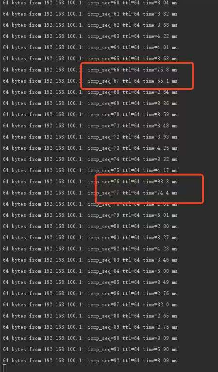
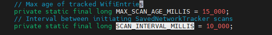
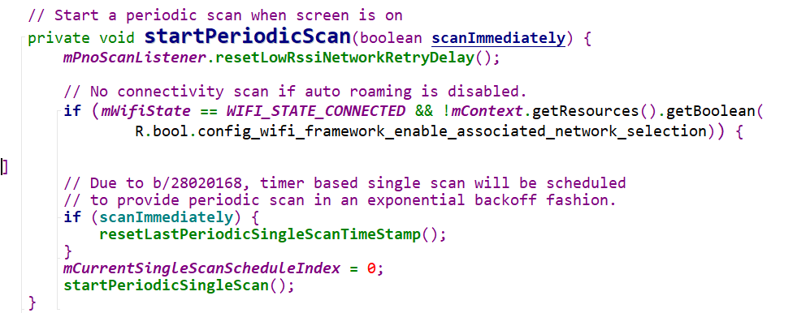
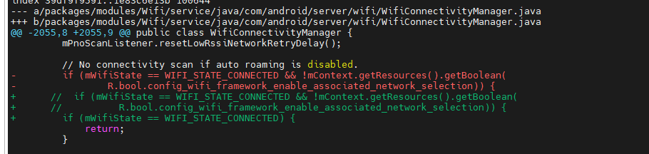

+++

date = '2026-07-16T15:08:06+08:00'
draft = false
title = 'Andorid wifi scan导致周期性出现延迟问题分析'
summary = "分析在Android13下wifi sacn机制"
categories = ["问题分析"]
tags = ["全志","A527","wi-Fi", "android","信号延迟"]

+++

## 1. 环境

- ### 平台：a527

- ### 系统：Android 13

- ### Wi-Fi 型号：AP6256

## 2. 问题描述

联网后 ping 一个地址，发现每隔十个包左右就会出现一次大延迟，呈周期性。



## 3. 结果

### 3.1 原因分析

跟供应商沟通，说是周期性的延迟大概率是因为 scan 导致的，所以深入了解了一下安卓系统的 Wi-Fi scan 机制。

Wi-Fi 的扫描场景分为下面四种情况：

1. **亮屏情况下，在 Wi-Fi settings 界面，固定扫描，扫描时间为 10s。**
2. **亮屏情况下，在非 Wi-Fi settings 界面，二进制指数退避扫描，退避：interval * (2^n)，最小间隔 min=20s，最大间隔 max=160s。**
3. **灭屏情况下，有保存网络时，若已连接，不扫描；否则进行 PNO 扫描，即只扫描已保存的网络。最小间隔 min=20s，最大间隔 max=20s*3=60s。**
4. **无保存网络情况下，固定扫描，间隔为 5 分钟，用于通知用户周围存在可用开放网络。**

因为客户的机器是不休眠的，所以只需要考虑亮屏情况下的 1、2，可以分为在 Wi-Fi settings 界面和非 Wi-Fi settings 界面。

#### Wi-Fi settings 设置界面 scan 修改位置

1. `ConfigureWifiEntryFragment.java`：对应连接 Wi-Fi、输入密码时页面创建的 `ScanResultUpdater`。
2. `WifiPickerTrackerHelper.java`：对应进入 Wi-Fi 扫描页面时创建的 `ScanResultUpdater`。

**文件都有SCAN_INTERVAL_MILLIS 变量：**



`SCAN_INTERVAL_MILLIS = 10`，所以在 Wi-Fi 设置界面的 scan 周期为 10。

#### 非 Wi-Fi settings 设置界面 scan 修改位置

​	**WifiConnectivityManager.java：**

```c
// 这是 Wi-Fi状态
public static final int WIFI_STATE_UNKNOWN = 0;
public static final int WIFI_STATE_CONNECTED = 1;
public static final int WIFI_STATE_DISCONNECTED = 2;
public static final int WIFI_STATE_TRANSITIONING = 3;
```



可以知道，当自动漫游没有被关闭的时候，屏幕开启之后，有连接依旧进行周期 scan。

#### 如何知道系统有无wifi  scan 操作

​	可以使用 logcat，然后观察 `hw_scan` 类似的打印来判断是否进行了 scan。

### 3.2 解决方法

客户想要在有连接的情况下退出WIFI settings界面不进行 scan，对应第二种情况：亮屏情况下，在非 Wi-Fi settings 界面



直接去除了自动漫游的判断，只要一有连接就直接返回。也可以在系统手动关闭漫游开关。
