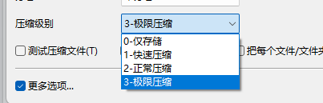

+++

date = '2026-07-23T15:08:06+08:00'
draft = false
title = '开机动画结束之后黑屏问题分析'
summary = "分析非首次开机动画结束之后到进入桌面的过程中出现黑屏问题"
categories = ["问题分析"]
tags = ["全志","A527","显示", "开机动画", "黑屏"]

+++

## 1. 环境

- 平台：A527
- 系统环境：Android 13

## 2. 问题描述

开机动画结束之后到进入桌面的过程中出现黑屏，非首次开机时依旧存在。

## 3. 结果

### 3.1 原因分析

问题由开机动画压缩包的压缩等级过高导致。

### 3.2 解决方法

重新压缩开机动画压缩包，并将压缩等级设置为 **0 - 仅存储**。

