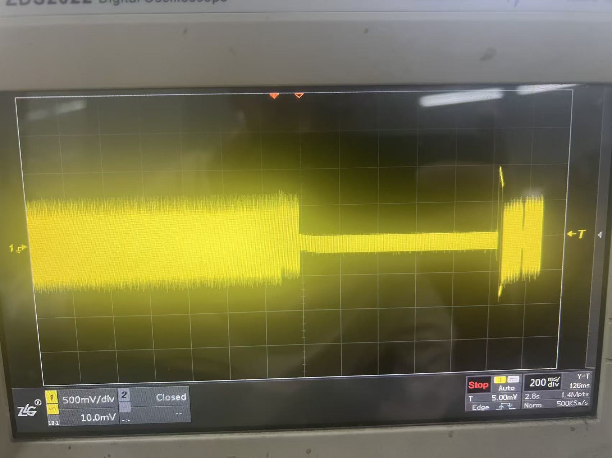
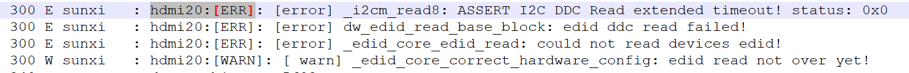
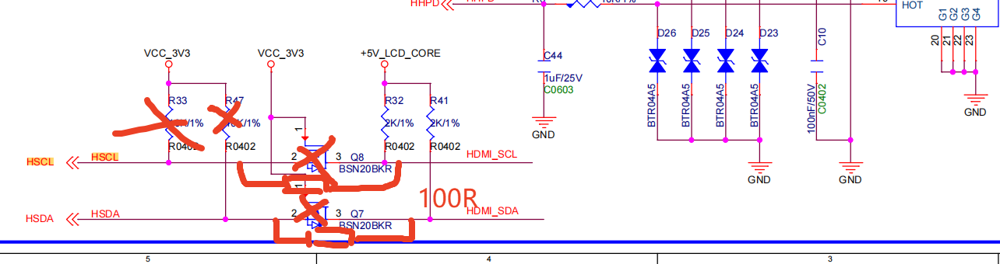

+++

date = '2026-07-23T15:08:06+08:00'
draft = false
title = 'HDMI 开机中途短暂无信号问题'
summary = "分析HDMI 开机中途短暂无信号问题"
categories = ["问题分析"]
tags = ["全志","A527","显示", "HDMI", "无信号"]

+++

## 1. 环境

- 平台：A527
- 系统环境：Android 13

## 2. 问题描述

### 2.1 现象演示

开机过程中出现短暂无信号过程，表现为蓝屏或者黑屏（根据屏幕的无信号现象），定位是在 U-Boot 到内核的过渡阶段。

### 2.2 过程描述

开机即可 100% 出现。

### 2.3 附录图片

示波器抓到的型号波形图，中间为无信号现象。

## 3. 结果

### 3.1 原因分析

通过 logcat 查看日志发现：

i2cm 是 HDMI 类似于 I2C 的通信失败，导致 HDMI DDC 获取 EDID 失败，进而造成演出无信号。

### 3.2 解决方法

修改底板设计，直接接 5V 上拉，不要进行电平转化。

