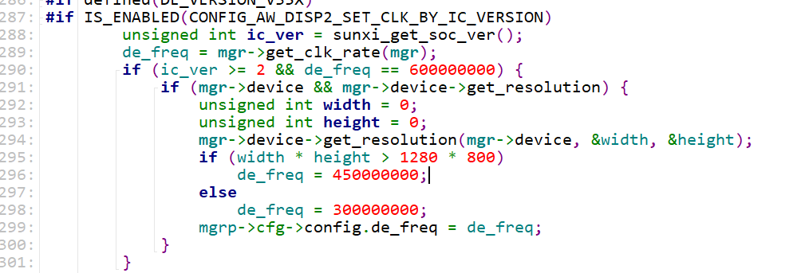
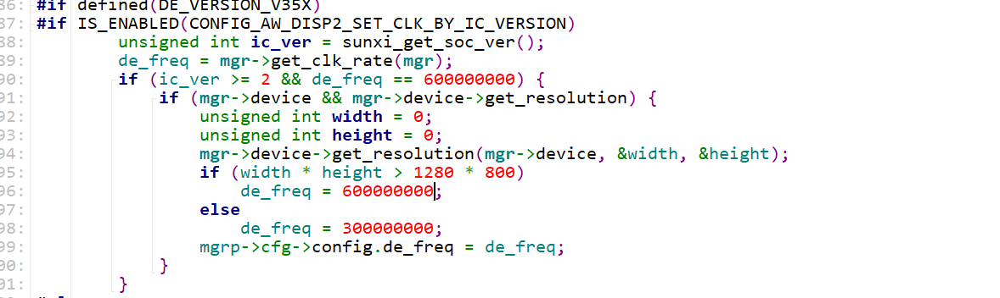
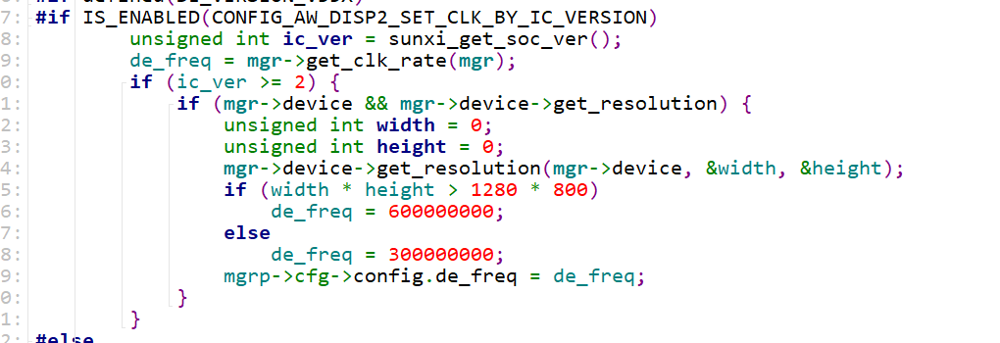

+++

date = '2026-07-16T15:08:06+08:00'
draft = false
title = 'HDMI 4k分辨率下显示花屏问题分析'
summary = "分析4K hdmi分辨率下花屏问题"
categories = ["问题分析"]
tags = ["全志","a527","显示", "HDMI", "花屏"]

+++

## 1. 环境

- 平台：A527
- 框架：sunxi_disp2

## 2. 问题描述

设置hdmi输出为 4K 分辨率时出现花屏；从 720p 切换到 4K 时也会出现花屏。

## 3. 结果

### 3.1 原因分析

查看 FAQ，判断问题是 `de_freq` 频率太低带宽不够导致的。

涉及文件：`disp_manager.c`



原本 `de_freq` 设置为 `600000000`，经过判断后变为 `450000000`。

### 3.2 解决方法

#### 3.2.1 设置 4K 分辨率时花屏



将 `de_freq` 改为 `600000000` 即可。

#### 3.2.2 从 720p 切换到 4K 时花屏

随后发现，从 720p 切换到 4K 时仍会出现花屏。

根据代码逻辑，每次切换分辨率都会执行一次该段代码。当切换到 720p 时，`de_freq` 被设置为 `300000000`。随后由于存在以下判断条件：

```c
if (ic_ver >= 2 && de_freq == 600000000)
```

后续每次执行分辨率切换时，都不会再进入该条件分支，因此 `de_freq` 一直被固定为 `300000000`。



将条件：

```c
if (ic_ver >= 2 && de_freq == 600000000)
```

修改为：

```c
if (ic_ver >= 2)
```

即可使每次分辨率切换时，都能根据当前分辨率重新设置 `de_freq`。
